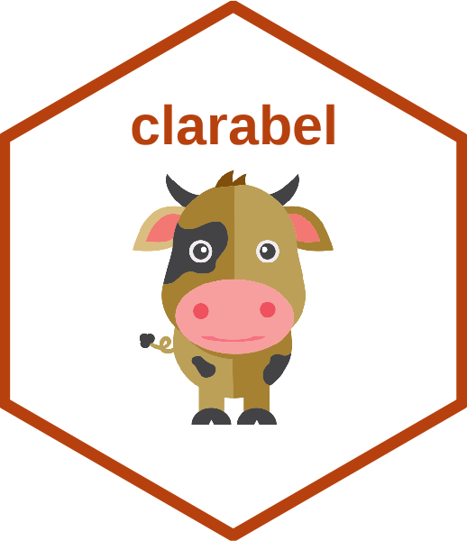

# clarabel 

[](https://github.com/oxfordcontrol/clarabel-r/actions/workflows/R-CMD-check.yaml)
[](https://cran.r-project.org/package=clarabel)

R interface to the
[Clarabel](https://oxfordcontrol.github.io/ClarabelDocs/stable/)
interior point conic optimization solver from the [Oxford Control
Group](https://github.com/oxfordcontrol).

Stable versions can be installed from CRAN as usual. Development
versions from this repo can be installed via:

```
## Install remotes packages if not available
if (! "remotes" %in% installed.packages()[, 1] ) {
	install.packages("remotes", repository = "https://cran.r-project.org")
}
remotes::install_github("oxfordcontrol/clarabel-r")
```

The above code assumes availability of the Cargo/Rust infrastructure
and R compilation tools to install from source, all freely available.

The [clarabel package
site](https://oxfordcontrol.github.io/clarabel-r/articles/clarabel.html)
has further package details including a vignette.

